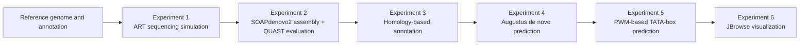
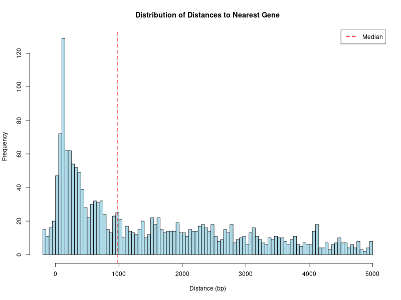
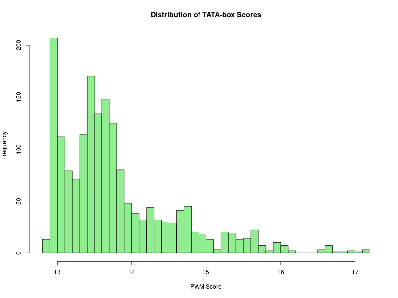
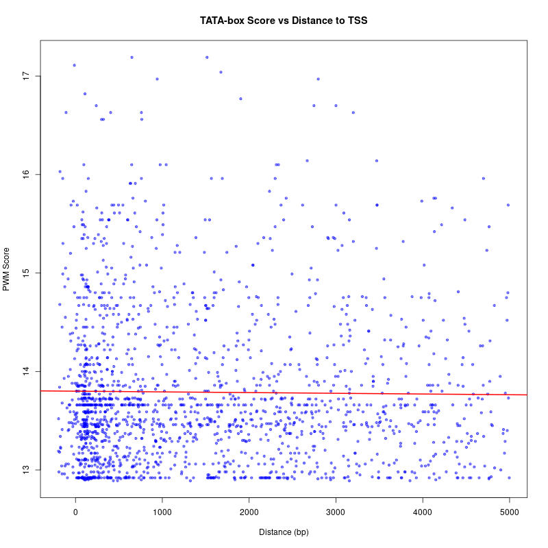

# Genome-Informatics-Task

> 基因组信息学课程实验仓库，围绕酿酒酵母基因组完成从测序模拟、组装、注释、DNA 元件预测到可视化的完整分析流程。

## 项目概览

本仓库整理了基因组信息学课程中的 6 个核心实验模块，研究对象为 **Saccharomyces cerevisiae**，使用的组装版本为 **HLJ1 Assembly v2 (GCA_903819155.2)**。项目材料同时保留了课程实验代码、关键中间结果、提交包以及完整实验文档。

完整文档见：

- [实验记录文档](实验记录文档.pdf)
- [总结文档](总结文档.pdf)

## 实验主线



## 六个实验模块

| 模块 | 内容 | 代表目录 / 文件 |
| --- | --- | --- |
| 实验 1 | 基因组测序模拟 | `实验记录文档.pdf`、`总结文档.pdf` |
| 实验 2 | 序列组装与评估 | `02_Assembly/` |
| 实验 3 | 同源搜索注释 | `03_Homology_Search/` |
| 实验 4 | 从头预测与基因结构建模 | `04_DeNovo_Prediction/` |
| 实验 5 | DNA 元件预测 | `05_DNA_Element/` |
| 实验 6 | 基因组数据可视化 | `06_Visualization/` |

## 主要结论

以下结论整理自 [`总结文档.pdf`](总结文档.pdf)：

- 测序深度对理论基因组覆盖率影响显著，覆盖度由低到高时覆盖率迅速接近饱和。
- 在组装结果中，**33x scaffold** 的连续性表现最佳，是本次实验中最优的组装方案。
- 同源搜索结果转换时，**Perl 方案**在基因结构还原上优于 Python 方案。
- `Augustus` 共预测出 **5413 个基因**，碱基水平灵敏度较高，但内含子层面的准确性仍有提升空间。
- PWM 扫描得到的 **TATA-box** 信号在 TSS 上游区域明显富集，支持其启动子相关的生物学意义。
- `JBrowse` 能够把参考基因组、同源注释、从头预测和 DNA 元件结果整合到统一浏览界面中。

## 仓库结构

```text
.
├── 02_Assembly/                          # SOAPdenovo2 批量组装与 QUAST 评估脚本
├── 03_Homology_Search/                  # 比对、同源搜索和 GffCompare 评估结果
├── 04_DeNovo_Prediction/                # Augustus 预测结果及 BLASTP 验证
├── 05_DNA_Element/                      # TATA-box PWM 扫描、邻近基因注释与统计图
├── 06_Visualization/                    # JBrowse 数据包
├── Submission_GongZhiyuan_2330416033/   # 课程提交版整理结果
├── fna.fna                              # 参考基因组序列
├── gff.gff                              # 参考注释
├── 实验记录文档.pdf
└── 总结文档.pdf
```

## 关键脚本

| 文件 | 作用 |
| --- | --- |
| `02_Assembly/run_soap.sh` | 批量运行 SOAPdenovo2 进行不同覆盖度样本的组装 |
| `02_Assembly/run_quast_cmp.sh` | 一次性比较多个 contig / scaffold 组装结果 |
| `05_DNA_Element/predict_tata.py` | 基于 PWM 的全基因组 TATA-box 扫描 |
| `05_DNA_Element/find_neighbors.py` | 将预测到的 TATA-box 与邻近基因及距离关系关联起来 |
| `pack.sh` | 打包课程提交材料 |

## 软件环境

根据总结文档，项目主要使用的软件包括：

- `ART`
- `FastQC`
- `SOAPdenovo2`
- `QUAST`
- `Bowtie2`
- `Samtools`
- `Bedtools`
- `BLAST+`
- `Augustus`
- `GffCompare`
- `Python 3.11.4`
- `R 3.6.3`

## DNA 元件预测结果展示

`05_DNA_Element/` 目录给出了 TATA-box 预测后的统计可视化结果，下面三张图可以直接概括这一部分分析：

<table>
  <tr>
    <td align="center">
      
      <br />
      <sub>TATA-box 与邻近 TSS 距离分布。</sub>
    </td>
    <td align="center">
      
      <br />
      <sub>PWM 打分分布。</sub>
    </td>
    <td align="center">
      
      <br />
      <sub>TATA-box 打分与距离 TSS 的关系。</sub>
    </td>
  </tr>
</table>

## 可直接查看的结果文件

- `03_Homology_Search/Sc_perl_eval.stats`
- `03_Homology_Search/Sc_python_eval.stats`
- `04_DeNovo_Prediction/augustus_eval.stats`
- `05_DNA_Element/TATA_annotated.gff3`
- `05_DNA_Element/score_distance.txt`
- `06_Visualization/jbrowse_data.zip`

## 如何阅读这个仓库

如果你希望快速理解整个项目，建议按下面顺序查看：

1. 先读 [总结文档](总结文档.pdf)，把整体实验设计和结论建立起来。
2. 再看 `02_Assembly/`、`03_Homology_Search/`、`04_DeNovo_Prediction/`、`05_DNA_Element/` 四个核心结果目录。
3. 最后打开 `06_Visualization/jbrowse_data.zip` 或 `Submission_GongZhiyuan_2330416033/`，查看提交版整理结果。
